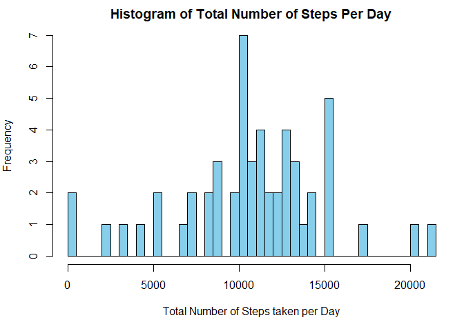
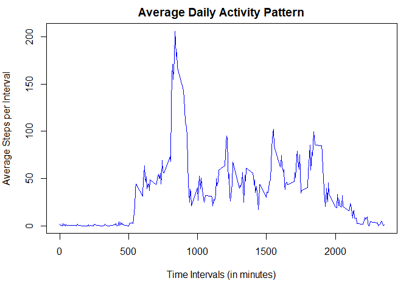
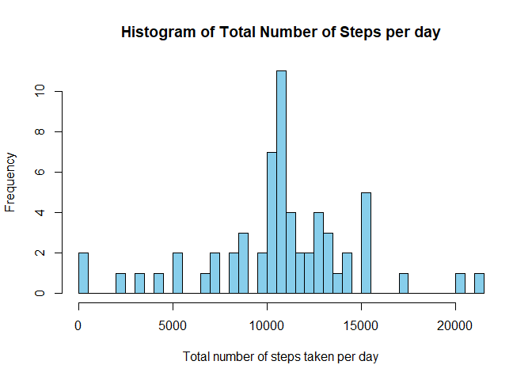
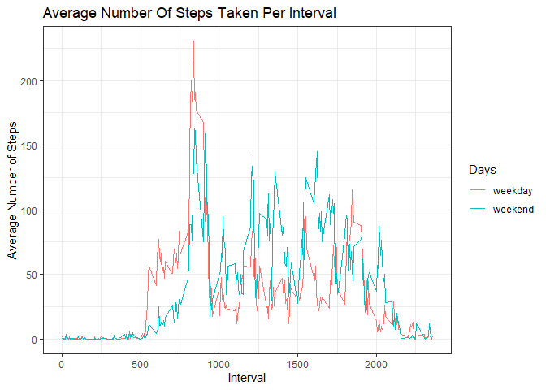

Configuring some global settings for this R markdown file


## Loading and preprocessing the data


```r
unzip(zipfile = "activity.zip")
active <- read.csv(file = "activity.csv")
```

## What is mean total number of steps taken per day?


```r
active2 <- active[complete.cases(active),]
totalSteps <- tapply(active2$steps, active2$date, sum, simplify = TRUE)
totalSteps <- totalSteps[complete.cases(totalSteps)]
par(mar = c(5, 4, 2, 1))
hist(totalSteps, 
     main = "Histogram of Total Number of Steps Per Day", 
     xlab = "Total Number of Steps taken per Day",
     col = "sky blue",
     breaks = 50)
```

<!-- -->

The mean of the total number of steps per day:  


```r
mean(totalSteps)
```

```
## [1] 10766.19
```

The median of the total number of steps per day:  


```r
median(totalSteps)
```

```
## [1] 10765
```

## What is the average daily activity pattern?


```r
activeAvg <- aggregate(active2$steps, by = list(active2$interval), mean)
names(activeAvg) <- c("intervals", "averageSteps")
par(mar = c(5, 4, 2, 1))
with(activeAvg, plot(intervals, averageSteps, type = "l",
                     xlab = "Time Intervals (in minutes)",
                     ylab = "Average Steps per Interval",
                     main = "Average Daily Activity Pattern",
                     col = "blue"))
```

<!-- -->

The interval in which maximum average number of steps have been taken:


```r
activeAvg$intervals[which.max(activeAvg$averageSteps)]
```

```
## [1] 835
```

## Imputing missing values

The total number of rows with NAs in the dataset:


```r
sum(is.na(active))
```

```
## [1] 2304
```

Code for filling the missing values in the dataset:


```r
active3 <- active
for(i in seq_along(active3$steps)){
    if(is.na(active3$steps[i])){
        int <- active3$interval[i]
        st <- activeAvg[activeAvg$intervals == int,]$averageSteps
        active3$steps[i] <- st
    }
}
```

Code for calculating the total number of steps taken per day, and the histogram:


```r
totalSteps2 <- tapply(active3$steps, active3$date, sum, simplify = TRUE)
hist(totalSteps2, 
     main = "Histogram of Total Number of Steps per day",
     xlab = "Total number of steps taken per day",
     col = "sky blue",
     breaks = 50)
```

<!-- -->

The mean of the total number of steps taken per day:


```r
mean(totalSteps2)
```

```
## [1] 10766.19
```

The median of the total number of steps taken per day:


```r
median(totalSteps2)
```

```
## [1] 10766.19
```

As you can see, the median is the same as the mean in this case, after imputing the NAs in the dataset by the average steps taken for the corresponding interval value over the two months. In the previous case, the median and the means were different, when the missing values in the dataset were ignored.  

So, adding the imputed values using the aforementioned method will result in the mean and the median becoming equal.  

## Are there differences in activity patterns between weekdays and weekends?

Code for creating a new factor variable in the dataset with two levels, "weekdays" and "weekends":


```r
wd <- weekdays(as.Date(active3$date))
weekFactor <- vector("character")
for(i in seq_along(wd)){
    if((wd[i] == "Saturday")||(wd[i] == "Sunday")){
        weekFactor <- append(weekFactor, "weekend")
    }
    else{
        weekFactor <- append(weekFactor, "weekday")
    }
}
weekFactor <- as.factor(weekFactor)
```

Code for creating a panel plot, split by weekdays and weekends:


```r
library(ggplot2)
active4 <- data.frame(active3, WeekFactor = weekFactor)
activeWeekSplit <- split(active4, active4$WeekFactor)
activeWeekday <- activeWeekSplit[["weekday"]]
activeWeekend <- activeWeekSplit[["weekend"]]
activeAvg1 <- aggregate(activeWeekday$steps, by = list(activeWeekday$interval),
                             mean)
activeAvg2 <- aggregate(activeWeekend$steps, by = list(activeWeekend$interval),
                             mean)
activeAvg1 <- data.frame(activeAvg1, day = rep("weekday", 288))
activeAvg2 <- data.frame(activeAvg2, day = rep("weekend", 288))
Ints <- c(activeAvg1$Group.1, activeAvg2$Group.1)
St <- c(activeAvg1$x, activeAvg2$x)
dy <- as.factor(c(as.character(activeAvg1$day), as.character(activeAvg2$day)))
activeAvgDay <- data.frame(intervals = Ints, steps = St, days = dy)
g <- ggplot(activeAvgDay, mapping = aes(intervals, steps))
print(g + geom_line(aes(color = days))
      + labs(title = "Average Number Of Steps Taken Per Interval",
             x = "Interval",
             y = "Average Number of Steps")
      + theme_bw()
      + labs(color = "Days"))
```

<!-- -->
